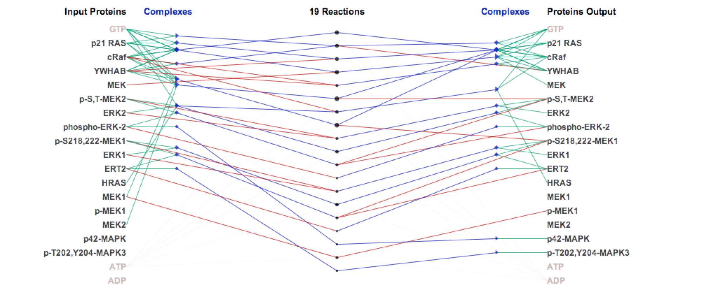

ReactionFlow
=============
Please click to watch the overview video.

ReactionFlow is a visual analytics application for pathway analysis that emphasizes the structural and causal relationships amongst proteins, complexes, and biochemical reactions within a given pathway. To support the identified causality analysis tasks, user interactions allow an analyst to filter, cluster, and select pathway components across linked views. Animation is used to highlight the flow of activity through a pathway. 

We have defined a causal relationship between two reactions if the output participants of one reaction act as the input to another reaction. Causality is therefore a directed relationship, and in our visualizations causality is depicted through the use of gradient-filled lines, where direction flows from yellow to black as depicted in the following figure. In other words, reaction 2 is downstream of reaction 1.

The following figure shows an example of using ReactionFlow to analyze the Influenza Infection pathway. In the first panel, we show all causal relationships (yellow-black gradient arcs) of 52 biochemical reactions in the pathway. Input and output participants are aligned on the left and right which can be highlighted when rolling over a reaction. In the second panel, we show downstream effects (red arcs) of "knocking out" proteins in the first reaction.

Here are more examples:

The data is the RAF Cascade pathway. Within this view, input proteins are listed on the left, and output proteins are listed on the right. Input proteins may directly participate in a reaction (shown with green links) or they may form complexes with other proteins (shown with green links) before participating in a reaction (shown with blue links). Complexes are displayed either as blue diamonds or as blue triangles. Triangles represent complexes that only appear as inputs or outputs, while diamonds represent complexes that act as both inputs and outputs within the pathway.  There are 19 biochemical reactions shown as circles in the center of the view. The circle size is computed based on the number of input and output proteins and complexes of each reaction.

Viewers can fade these links and display all causal relationships in the pathway as depicted in the following figure.

The two following figures show similar actions performed on the ERBB2 pathway. The pathway data can be found on Reactome: http://www.reactome.org/PathwayBrowser/#/R-HSA-1227986

The following figure shows causal relationships of 51 biochemical reactions in the Rb-E2F pathway. 

The following figure shows causal relationships of 116 biochemical reactions in the Signaling by NGF pathway. The pathway data can be found on Reactome:
http://www.reactome.org/PathwayBrowser/#/R-HSA-166520

The following figure shows causal relationships of 95 biochemical reactions in the Signaling by NOTCH pathway. The pathway data can be found on Reactome:
http://www.reactome.org/PathwayBrowser/#/R-HSA-157118&PATH=R-HSA-162582

The following figure shows causal relationships of 200 biochemical reactions in the Myoclonic pathway. This representation reveals the linear nature of this pathway.

The following figure shows causal relationships of 95 biochemical reactions in the Signaling by TGF pathway. The red arcs depict downstream effects of removing one biochemical reaction from the pathway. The pathway data can be found on Reactome:
http://www.reactome.org/PathwayBrowser/#/R-HSA-170834&PATH=R-HSA-162582

The following figure shows causal relationships of 292 biochemical reactions in the Signaling by GPCR pathway. The pathway data can be found on Reactome:
http://www.reactome.org/PathwayBrowser/#/R-HSA-372790&PATH=R-HSA-162582

The application (ReactionFlow_1_1.jar) is available in application.Cross-Platform folder.

This work was funded by the DARPA Big Mechanism Program under ARO contract WF911NF-14-1-0395. A paper on ReactionFlow was presented at the BioVis track at ISMB 2015 in Dublin, Ireland: 

TN Dang, P Murray, J Aurisano, and AG Forbes. [ReactionFlow: An interactive visualization tool for causality analysis in biological pathways](https://creativecoding.soe.ucsc.edu/pdfs/Dang_ReactionFlow_BioVis2015.pdf). BMC Proceedings 9(6), 2015.

@article{DangReactionFlowBioVis2015,
title={{ReactionFlow: A}n interactive visualization tool for causality analysis in biological pathways},
author={Tuan N. Dang and Paul Murray and Jillian Aurisano and Angus G. Forbes},
journal = {{BMC Proceedings}},
address={Dublin, Ireland},
volume = {9},
number={6},
pages={S6},
year = {2015},
month = {August},
note = {\doi{10.1186/1753-6561-9-S6-S6}}
}

